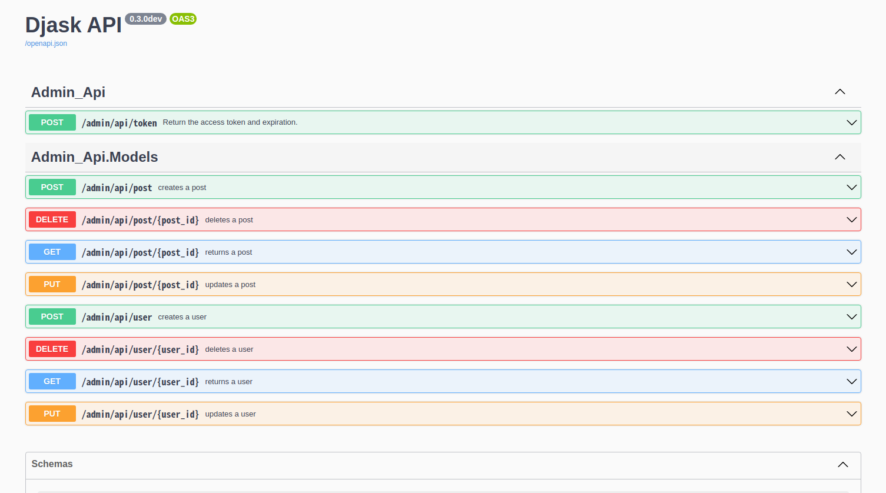
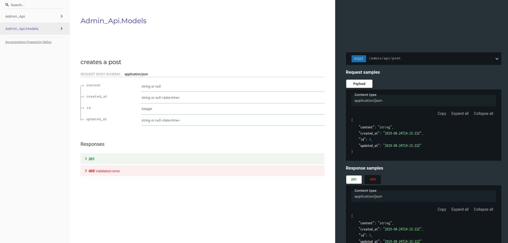

Diving into Models
------------------

This part of documentation will explore all what Djask can do with your SQLAlchemy models.

Preparations
============

Above all, let's start with a simple demo.

.. code-block:: python

    from djask import Djask
    from djask.admin import Admin
    from djask.db import Model
    from djask.auth.models import User
    import sqlalchemy as sa

    app = Djask(__name__)
    admin_ext = Admin()  # initialize the admin site
    admin_ext.init_app(app)
    db = app.db

    class Post(Model):
        title = sa.Column(sa.String(255), index=True)
        content = sa.Column(sa.Text)

    @app.before_first_request
    def init_db():
        app.register_model(Post)
        db.create_all()
        admin = User(username="test", is_admin=True)
        admin.set_password("password")
        db.session.add(admin)
        db.session.commit()

Djask automatically generates a web API for your models.
In this documentation, we will use `httpie <https://httpie.io/>`_ to test our web API.
You can install it using your system's package manager or `pipx <https://pypa.github.io/pipx/installation/>`_.

Authentication & the user API
=============================

Djask's default web api uses bearer tokens to authenticate users.
Note that if the user doesn't have admin access, the authentication will fail.

Getting your token
##################

.. code-block:: text

    http --form :5000/admin/api/token username=test password=password

You'll see something like this:

.. code-block:: text

    HTTP/1.0 200 OK
    Cache-Control: no-store
    Content-Length: 203
    Content-Type: application/json
    Date: Wed, 19 Jan 2022 04:42:29 GMT
    Pragma: no-cache
    Server: Werkzeug/2.0.2 Python/3.9.9

    {
        "access_token": "eyJhbGciOiJIUzUxMiIsImlhdCI6MTY0MjU2NzM0OSwiZXhwIjoxNjQyNTcwOTQ5fQ.eyJpZCI6MX0.E7Mr_9tWdaGK_Kz4JBoJXJkmSNdKgb2QA4xGBl0JlQnJMFt-cG1GHhxhrSq61ip9NiY5czYeWxfo1FUNJB-flw",
        "expires_in": 3600
    }

Creating a user
###############

Copy the ``access_token`` above and save it into a session.

.. code-block:: text

    http --json :5000/admin/api/user username=test2 password=password Authorization:"eyJhbGciOiJIUzUxMiIsImlhdCI6MTY0MjU2NzM0OSwiZXhwIjoxNjQyNTcwOTQ5fQ.eyJpZCI6MX0.E7Mr_9tWdaGK_Kz4JBoJXJkmSNdKgb2QA4xGBl0JlQnJMFt-cG1GHhxhrSq61ip9NiY5czYeWxfo1FUNJB-flw" --session=Authorization

    HTTP/1.0 201 CREATED
    Content-Length: 95
    Content-Type: application/json
    Date: Wed, 19 Jan 2022 23:39:04 GMT
    Server: Werkzeug/2.0.2 Python/3.9.9

    {
        "email": null,
        "id": 2,
        "is_admin": false,
        "name": null,
        "username": "test2"
    }

Retrieving a user
##############

.. code-block:: text

    http GET :5000/admin/api/user/1 --session=Authorization

    HTTP/1.0 200 OK
    Content-Length: 93
    Content-Type: application/json
    Date: Wed, 19 Jan 2022 05:35:56 GMT
    Server: Werkzeug/2.0.2 Python/3.9.9

    {
        "email": null,
        "id": 1,
        "is_admin": true,
        "name": null,
        "username": "test"
    }

Since we haven't declared the real name and the email of the test user, it's normal to get a null value.

Updating a user
###############

.. code-block:: text

    http --json PUT :5000/admin/api/user/1 username="abc" --session=Authorization

    HTTP/1.0 200 OK
    Content-Length: 92
    Content-Type: application/json
    Date: Wed, 19 Jan 2022 08:54:37 GMT
    Server: Werkzeug/2.0.2 Python/3.9.9

    {
        "email": null,
        "id": 1,
        "is_admin": true,
        "name": null,
        "username": "abc"
    }

Deleting a user
###############

.. warning::

    This operation might delete the admin user. You can create a new admin user by
    running ``flask admin create`` in your terminal.

.. code-block:: text

    http DELETE :5000/admin/api/user/1 --session=Authorization

    HTTP/1.0 204 NO CONTENT
    Content-Type: application/json
    Date: Wed, 19 Jan 2022 09:09:38 GMT
    Server: Werkzeug/2.0.2 Python/3.9.9

API for other models
====================

Djask has a general web api applicable for all the data models as long as you register
the data models to the app with :py:meth:`~djask.Djask.register_model` or :py:meth:`~djask.Djask.register_models`.

.. admonition:: Data persistence

    The simple demo above only persists the data in memory. Therefore, if it's reloaded,
    the data will be lost. You should recreate the instances again after reloading the app
    or try using MySQL or Postgres, etc. to persist the data.

Creating an instance
####################

.. code-block:: text

    http --json POST :5000/admin/api/post title=hello content=world --session=Authorization

    HTTP/1.0 201 CREATED
    Content-Length: 158
    Content-Type: application/json
    Date: Wed, 19 Jan 2022 23:44:15 GMT
    Server: Werkzeug/2.0.2 Python/3.9.9

    {
        "content": "world",
        "created_at": "Wed, 19 Jan 2022 23:44:15 GMT",
        "id": 1,
        "title": "hello",
        "updated_at": "Wed, 19 Jan 2022 23:44:15 GMT"
    }

Retrieving an instance
######################

.. code-block:: text

    http GET :5000/admin/api/post/1 --session=Authorization

    HTTP/1.0 200 OK
    Content-Length: 158
    Content-Type: application/json
    Date: Wed, 19 Jan 2022 23:52:12 GMT
    Server: Werkzeug/2.0.2 Python/3.9.9

    {
        "content": "world",
        "created_at": "Wed, 19 Jan 2022 23:51:52 GMT",
        "id": 1,
        "title": "hello",
        "updated_at": "Wed, 19 Jan 2022 23:51:52 GMT"
    }

Updating an instance
####################

.. code-block:: text

    http --json PUT :5000/admin/api/post/1 title=hello2 content=world2 --session=Authorization

    HTTP/1.0 200 OK
    Content-Length: 160
    Content-Type: application/json
    Date: Wed, 19 Jan 2022 23:59:33 GMT
    Server: Werkzeug/2.0.2 Python/3.9.9

    {
        "content": "world2",
        "created_at": "Wed, 19 Jan 2022 23:51:52 GMT",
        "id": 1,
        "title": "hello2",
        "updated_at": "Wed, 19 Jan 2022 23:51:52 GMT"
    }

Deleting an instance
####################

.. code-block:: text

    http DELETE :5000/admin/api/post/1 --session=Authorization

    HTTP/1.0 204 NO CONTENT
    Content-Type: application/json
    Date: Thu, 20 Jan 2022 00:00:57 GMT
    Server: Werkzeug/2.0.2 Python/3.9.9

API Docs
========

Djask extends APIFlask to provide API documentation for all registered models.

`Here <http://andyzhou.pythonanywhere.com/admin/api/docs>`_ is a demo.

Swagger UI
##########

The default path of Swagger UI is ``/admin/api/docs``.

Redoc
#####

Similarly, the default path of Redoc is ``/admin/api/redoc``.

