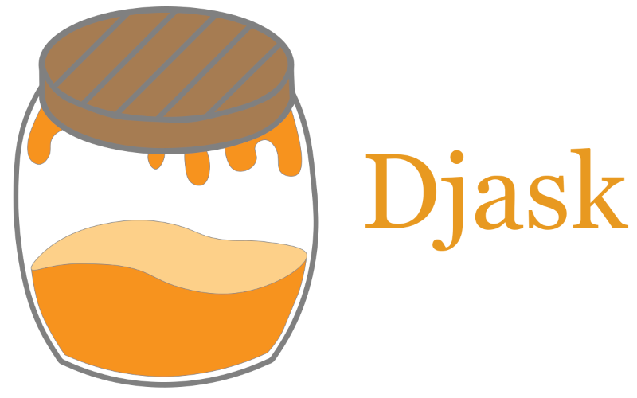

.. djask documentation master file, created by
   sphinx-quickstart on Mon Nov  1 22:46:04 2021.
   You can adapt this file completely to your liking, but it should at least
   contain the root `toctree` directive.

Welcome to Djask
=================================

Djask is full-featured Python Web framework based on the famous project `Flask <https://flask.palletsprojects.com/>`_.
It aims to be *a Django in Flask*. It features a pluggable admin interface just like Django. Also based on `Grey Li <https://greyli.com>`_'s project `APIFlask <https://apiflask.com>`_,
Djask comes with a full support of Web APIs.

Djask is closely bound to the powerful ORM `SQLAlchemy <https://www.sqlalchemy.org>`_, giving you best experiences.

API Reference
-------------
.. toctree::
   quickstart
   api

Indices and tables
==================

* :ref:`genindex`
* :ref:`modindex`
* :ref:`search`
