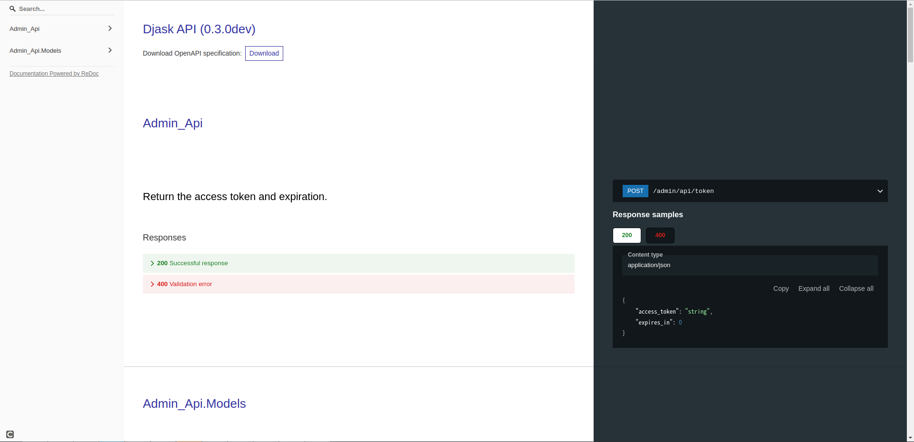

Models and Web API
------------------

This part of documentation will explore all what Djask can do with your SQLAlchemy models.

Preparations
============

Above all, let's start with a simple demo.

Our demo
########

.. code-block:: python

    """
    This app.py is just a simple demo. Do not write code like this in production.
    """
    from djask import Djask
    from djask.admin import Admin
    from djask.db import Model
    from djask.auth.abstract import AbstractUser
    import sqlalchemy as sa

    class Post(Model):
        title = sa.Column(sa.String(255), index=True)
        content = sa.Column(sa.Text)
        author = sa.orm.relationship("User", back_populates="posts")
        author_id = sa.Column(sa.ForeignKey("user.id"))

    class User(AbstractUser, Model):
        posts = sa.orm.relationship("Post", back_populates="author")

    # 1
    app = Djask(__name__, {"AUTH_MODEL": User})
    admin_ext = Admin()  # initialize the admin site
    admin_ext.init_app(app, mode="api") # 2
    db = app.db

    app.config["AUTH_MODEL"] = User

    @app.before_first_request
    def init_db():
        db.drop_all()
        app.register_model(Post) # 3
        db.create_all()
        admin = User(username="test", is_admin=True)
        admin.set_password("password")
        db.session.add(admin)
        db.session.commit()
        db.create_all()

Some explanations
#################

Here are some explanations to the demo above.

``# 1``: We passed a config dict directly to the app.
Inside the dict, we declared the customized ``AUTH_MODEL``, if
you don't specify it, :class:`~djask.auth.models.User` is the default.
Djask will automatically register this model for you.

``# 2``: We selected a mode named ``api``, another available
option is ``ui`` which stands for the admin frontend interface.
The default value passed is ``("api", "ui")`` which contains both
web api and admin frontend interface.

``# 3``: We registered the ``Post`` model.

Other preparations
##################

Djask automatically generates a web API for your models.
In this documentation, we will use `httpie <https://httpie.io/>`_
to test our web API. You can install it using your system's package
manager or `pipx <https://pypa.github.io/pipx/installation/>`_.

Models
======

Djask provides two types of base models, :class:`~djask.db.models.Model` and :class:`~djask.db.models.PureModel`.

:class:`~djask.db.models.Model` is initialized with three columns, ``id``, ``created_at`` and ``updated_at``, and
instances of this class can be registered by ``app.register_model()`` or ``blueprint.register_model()``.
:class:`~djask.db.models.PureModel` is similar to :class:`~djask.db.models.Model`, but it has no columns when it's created.
Therefore, it CANNOT be registered to the admin interface by ``app.register_model()`` or ``blueprint.register_model()``. If
it's passed to ``app.register_model()`` or ``blueprint.register_model()``, it will raise an error.

Authentication & the user API
=============================

Djask's default web api uses bearer tokens to authenticate users.
Note that if the user doesn't have admin access, the authentication
will fail.

Getting your token
##################

.. code-block:: text

    http --form :5000/admin/api/token username=test password=password

You'll see something like this:

.. code-block:: text

    HTTP/1.0 200 OK
    Cache-Control: no-store
    Content-Length: 213
    Content-Type: application/json
    Date: Sun, 23 Jan 2022 04:33:59 GMT
    Pragma: no-cache
    Server: Werkzeug/2.0.2 Python/3.9.9

    {
        "access_token": "eyJhbGciOiJIUzUxMiIsImlhdCI6MTY0MjkxMjQzOSwiZXhwIjoxNjQyOTE2MDM5fQ.eyJpZCI6MX0.70UFeHYAsPc12G002_3skcbi88_Q_oTG08uBxdC7dfJJ-uxkwpJ9wHvNz2Occ1APL_8xtVNXEkXiaq_VZms-Wg",
        "expires_in": 3600
    }

Creating a user
###############

Copy the ``access_token`` above and save it into a session.

.. code-block:: text

    http --json :5000/admin/api/user username=test2 password=password Authorization:"eyJhbGciOiJIUzUxMiIsImlhdCI6MTY0MjU2NzM0OSwiZXhwIjoxNjQyNTcwOTQ5fQ.eyJpZCI6MX0.E7Mr_9tWdaGK_Kz4JBoJXJkmSNdKgb2QA4xGBl0JlQnJMFt-cG1GHhxhrSq61ip9NiY5czYeWxfo1FUNJB-flw" --session=Authorization

    HTTP/1.0 201 CREATED
    Content-Length: 211
    Content-Type: application/json
    Date: Sun, 23 Jan 2022 04:36:22 GMT
    Server: Werkzeug/2.0.2 Python/3.9.9

    {
        "created_at": "Sun, 23 Jan 2022 04:36:22 GMT",
        "email": null,
        "id": 2,
        "is_admin": false,
        "name": null,
        "posts": [],
        "updated_at": "Sun, 23 Jan 2022 04:36:22 GMT",
        "username": "test2"
    }

Retrieving a user
#################

.. code-block:: text

    http GET :5000/admin/api/user/1 --session=Authorization

    HTTP/1.0 200 OK
    Content-Length: 209
    Content-Type: application/json
    Date: Sun, 23 Jan 2022 05:00:04 GMT
    Server: Werkzeug/2.0.2 Python/3.9.9

    {
        "created_at": "Sun, 23 Jan 2022 04:37:59 GMT",
        "email": null,
        "id": 1,
        "is_admin": true,
        "name": null,
        "posts": [],
        "updated_at": "Sun, 23 Jan 2022 04:37:59 GMT",
        "username": "test"
    }

Since we haven't declared the real name and the email of the test user, it's normal to get a null value.

Updating a user
###############

.. code-block:: text

    http --json PUT :5000/admin/api/user/1 username="abc" --session=Authorization

    HTTP/1.0 200 OK
    Content-Length: 208
    Content-Type: application/json
    Date: Sun, 23 Jan 2022 05:00:39 GMT
    Server: Werkzeug/2.0.2 Python/3.9.9

    {
        "created_at": "Sun, 23 Jan 2022 04:37:59 GMT",
        "email": null,
        "id": 1,
        "is_admin": true,
        "name": null,
        "posts": [],
        "updated_at": "Sun, 23 Jan 2022 04:37:59 GMT",
        "username": "abc"
    }

Deleting a user
###############

.. warning::

    This operation might delete the admin user. You can create a new admin user by
    running ``flask admin create`` in your terminal.

.. code-block:: text

    http DELETE :5000/admin/api/user/2 --session=Authorization

    HTTP/1.0 204 NO CONTENT
    Content-Type: application/json
    Date: Sun, 23 Jan 2022 05:03:32 GMT
    Server: Werkzeug/2.0.2 Python/3.9.9

API for other models
====================

Djask has a general web api applicable for all the data models as long as you register
the data models to the app with :py:meth:`~djask.Djask.register_model` or :py:meth:`~djask.Djask.register_models`.

.. admonition:: Data persistence

    The simple demo above only persists the data in memory. Therefore, if it's reloaded,
    the data will be lost. You should recreate the instances again after reloading the app
    or try using MySQL or Postgres, etc. to persist the data.

Creating an instance
####################

.. code-block:: text

    http --json POST :5000/admin/api/post title=hello content=world author_id=1 --session=Authorization

    HTTP/1.0 201 CREATED
    Content-Length: 399
    Content-Type: application/json
    Date: Sun, 23 Jan 2022 05:03:51 GMT
    Server: Werkzeug/2.0.2 Python/3.9.9

    {
        "author": {
            "created_at": "Sun, 23 Jan 2022 04:37:59 GMT",
            "email": null,
            "id": 1,
            "is_admin": true,
            "name": null,
            "updated_at": "Sun, 23 Jan 2022 04:37:59 GMT",
            "username": "abc"
        },
        "author_id": 1,
        "content": "world",
        "created_at": "Sun, 23 Jan 2022 05:03:51 GMT",
        "id": 1,
        "title": "hello",
        "updated_at": "Sun, 23 Jan 2022 05:03:51 GMT"
    }

Retrieving an instance
######################

.. code-block:: text

    http GET :5000/admin/api/post/1 --session=Authorization

    HTTP/1.0 200 OK
    Content-Length: 177
    Content-Type: application/json
    Date: Fri, 21 Jan 2022 03:29:02 GMT
    Server: Werkzeug/2.0.2 Python/3.9.9

    {
        "author_id": 1,
        "content": "world",
        "created_at": "Fri, 21 Jan 2022 03:28:17 GMT",
        "id": 1,
        "title": "hello",
        "updated_at": "Fri, 21 Jan 2022 03:28:17 GMT"
    }

Updating an instance
####################

.. code-block:: text

    http --json PUT :5000/admin/api/post/1 title=hello2 content=world2 --session=Authorization

    HTTP/1.0 200 OK
    Content-Length: 399
    Content-Type: application/json
    Date: Sun, 23 Jan 2022 05:04:20 GMT
    Server: Werkzeug/2.0.2 Python/3.9.9

    {
        "author": {
            "created_at": "Sun, 23 Jan 2022 04:37:59 GMT",
            "email": null,
            "id": 1,
            "is_admin": true,
            "name": null,
            "updated_at": "Sun, 23 Jan 2022 04:37:59 GMT",
            "username": "abc"
        },
        "author_id": 1,
        "content": "world",
        "created_at": "Sun, 23 Jan 2022 05:03:51 GMT",
        "id": 1,
        "title": "hello",
        "updated_at": "Sun, 23 Jan 2022 05:03:51 GMT"
    }

Deleting an instance
####################

.. code-block:: text

    http DELETE :5000/admin/api/post/1 --session=Authorization

    HTTP/1.0 204 NO CONTENT
    Content-Type: application/json
    Date: Sun, 23 Jan 2022 05:04:46 GMT
    Server: Werkzeug/2.0.2 Python/3.9.9

API Docs
========

Djask extends APIFlask to provide API documentation for all registered models.
Currently, Djask's API documentation will not reflect the relationships between
models.

`Here <http://andyzhou.pythonanywhere.com/admin/api/docs>`_ is a demo.

Swagger UI
##########

The default path of Swagger UI is ``/admin/api/docs``.

.. image:: _static/swagger_ui.png
   :alt: Swagger UI

Redoc
#####

Similarly, the default path of Redoc is ``/admin/api/redoc``.

