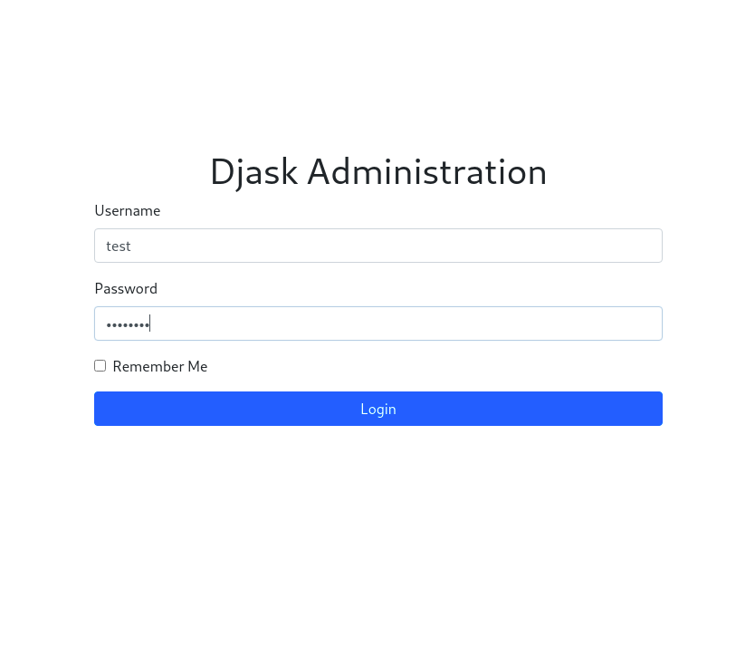
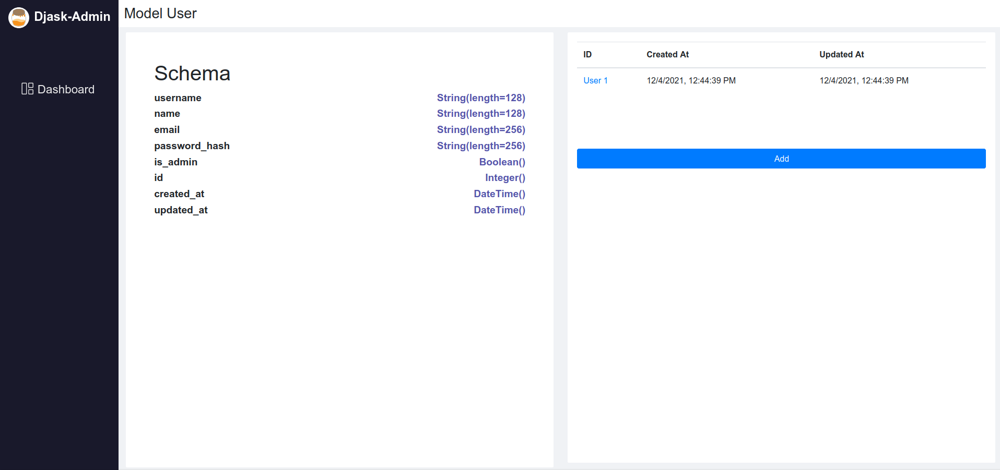
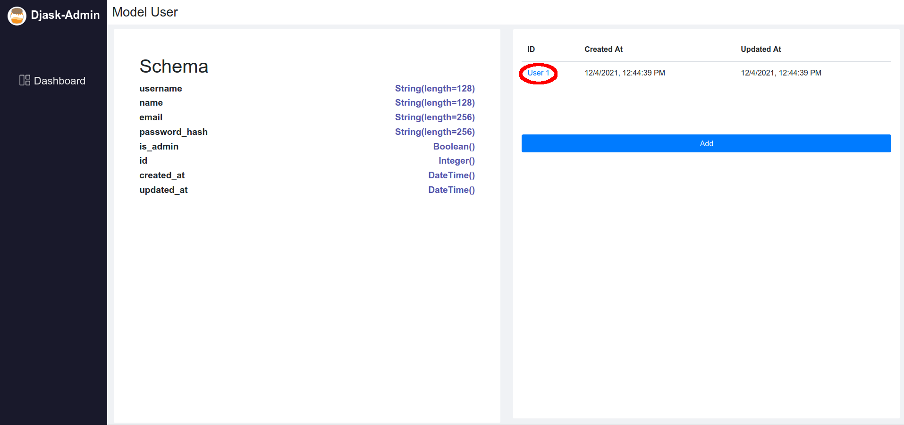
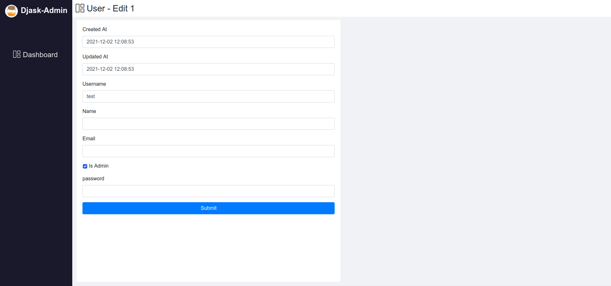

Quickstart
----------

This part of documentation will give an introduction to Djask.
We assume that you have used Flask for a period of time before.

Installation
============

Like any other Python packages, Djask can be installed through pip:

.. tabs::

   .. group-tab:: Mac OS X | Linux

      .. code-block:: text

         $ pip3 install djask

   .. group-tab:: MS-Windows

      .. code-block:: text

         > pip install djask

A minimal app
=============

.. code-block:: python

    """
    This app.py is just a simple demo. Do not write code like this in production.
    """
    from djask import Djask
    from djask.admin import Admin
    from djask.auth.models import User

    app = Djask(__name__)
    admin_ext = Admin()  # initialize the admin site
    admin_ext.init_app(app)
    db = app.db

    @app.before_first_request
    def init_db():
        db.create_all()
        admin = User(username="test", is_admin=True)
        admin.set_password("password")
        db.session.add(admin)
        db.session.commit()

Like what you do in Flask, you initialize an app with something like ``app = Djask("your-app")``.

The :class:`flask.admin.Admin` acts as an extension to your app to make this feature pluggable.
So you can just initialize the Admin *feature* like any other extension:

.. code-block:: python

    admin_bp = Admin()
    admin_bp.init_app(app)

Since SQL support is one of the new functions that Djask added on the top of Flask.
We registered :attr:`Djask.db` directly onto :class:`Djask`, enabling you to write codes like this:

.. code-block:: python

    from djask import current_app
    # suppose that ``app`` has been declared
    @app.route("/")
    def index():
        print(current_app.db)
        return "Hello World"

It's NOT recommended to initialize your database by using ``app.before_first_request`` and you should NEVER take this approach in production.
However, I used it here to quickly get you through.

The admin interface
===================

After a quick walk-through, we are going to check out the admin interface.

The default admin interface has a url prefix ``/admin``, which is unchangeable currently.
You'll able to change this default prefix in future releases.

Note that we are still using the same application as the previous section.

Make sure you have set up your environment. Then let's run the app:

.. code-block:: text

   $ flask run

Head over to `localhost:5000/admin/login <localhost:5000/admin/login>`_.
Log in the admin interface with ``test`` as username and ``password`` as password:

Then the dashboard is here for you:

Viewing a model
===============

The admin interface of Djask enables you to view a model schema. To check out this functionality, just click on
the model, or get to ``/admin/<your-model-name>``.
For example:

Editing a model
===============

With just a simple click on the ``<model-name> <model-id>`` button (as shown below), you can edit the model in the UI.

Adding a model
==============

To add an instance of a model, click on either the ``+`` button on the dashboard page or the ``Add`` button on the model page (``/admin/<your-model-name>``).

Explore models
==============

Wanna explore what Djask can do with your SQLAlchemy models?
See :doc:'diving_into_models'.
